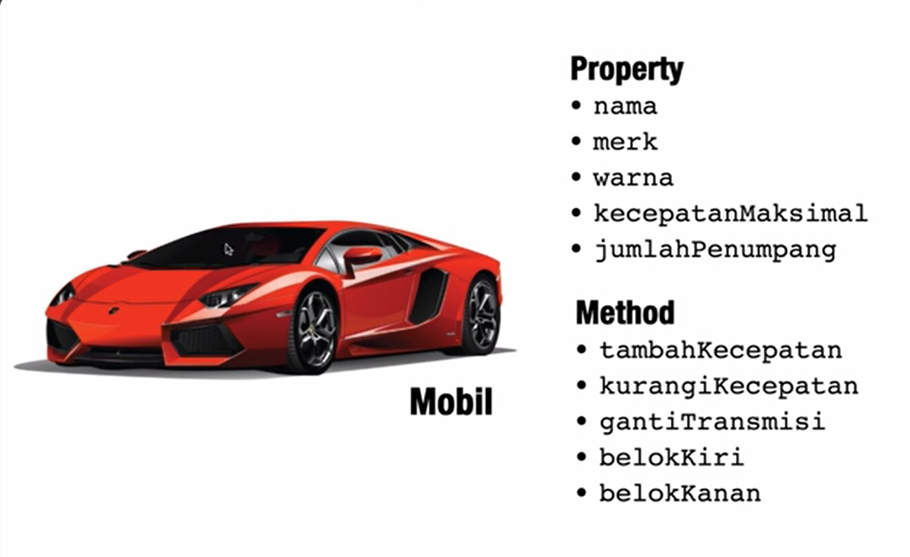

# Property & Method 

### Property
- Mempresentasikan data / keadaan dari sebuah object 
- Variabel yang ada di dalam object (member variabel)
- Sama seperti variabel di dalam PHP, di tambah dengan visibility di depannya

### Method 
- Mempresentasikan perilaku dari sebuah object 
- Function yang ada di dalam object 
- Sama seperti function didalam PHP, di tambah dengan visibility didepannya

Jika di ilustrasikan maka seperti ini : 

